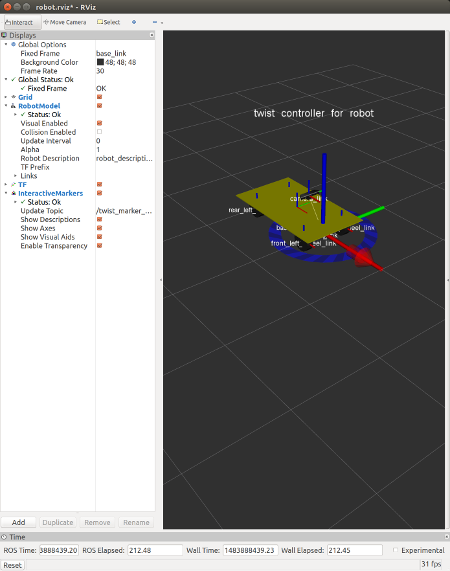

# Futurakart tutorials

Make sure you have builded `futurakart` catkin workspace and run `source devel/setup.bash` 
before proceed the tutorial. To build `futurakart` package and its dependencies, please see [here](./RPI-ROS-Installation.md)
If you have any trouble while launching some modules, please revisit installation part.

To open `futurakart` location and `source` fast, you can use the alias `fkart`. 
See 'setup_all.bash' paragraph in 'Useful tools' from [here](./README.md) to learn more about.


## Base part emulation on the desktop

You can test `futurakart` base part on the PC without any cards required.  
 
There are two options: a) configure and start manually all nodes, b) automatic default configuration start  

### Configure and start manually all nodes
Start mbed card emulation : 
```
roslaunch futurakart_mbed_emu emulator.launch
```
which emulates an ideal motor, that receives commands and directly applies it to its state.
There is no encoder emulation.

 
Next, start `futurakart_base` base node:
```
rosrun futurakart_base futurakart_node
```
You can see that emulator start to print that it receives a zero `motordrive_cmd` messages.
These messages are created from current state of the joints : direction and propulsion.


Now we need to start `futurakart_description` and `futurakart_control` :
```
roslaunch futurakart_description description.launch
```
and 
```
roslaunch futurakart_control control.launch
```
The last launch file start also the node `twist_to_ackermann` which converts twist messages to ackermann messages.

### Automatic default configuration start
  
All the previous commands can be executed using one file :
```
roslaunch futurakart_mbed_emu base_emu.launch
```

Now, you have to choices to drive with interactive markers or manually using terminal

### Driving with `key_teleop`

If needed, install `key_teleop` package with 
```
sudo apt-get install ros-kinetic-key-teleop  
```

### Driving with interactive markers
You need to have `interactive_markers_twist_server` package installed. See below the installation part.
Most probably, you need to `source`  from the path of `interactive_markers_twist_server` package. Once everything is OK, you can type:
```
roslaunch futurakart_control teleop.launch
```
and open rviz :
```
roslaunch futurakart_viz view_robot.launch
```

To command the kart you can pull the blue circle around it and it will drive.
Today, ackermann interactive markers controls is a hack of the original package [`interactive_markers_twist_server`](https://github.com/ros-visualization/interactive_marker_twist_server.git)
so it does not work perfectly.




### Drive it manually like a real man

And finally, now we are ready to publish a driving command using Ackermann messages :
```
rostopic pub -r 50.0 /ackermann_cmd ackermann_msgs/AckermannDrive "{'steering_angle': 0.05, 'speed': 0.1}"
``` 
Ackermann commands are in *m/s* for `speed` (propulsion velocity) and *rad* for `steering_angle` (direction position).

Open rviz and observe the kart moving:
```
roslaunch futurakart_viz view_robot.launch
```


## Install `interactive_markers_twist_server`
Clone the sources in a generic workspace, for example, like that:
```
$ mkdir -p ~/generic_ws/src; cd $_; catkin_init_workspace
$ git clone https://github.com/vfdev-5/interactive_marker_twist_server.git
$ cd ../; catkin_make
```

