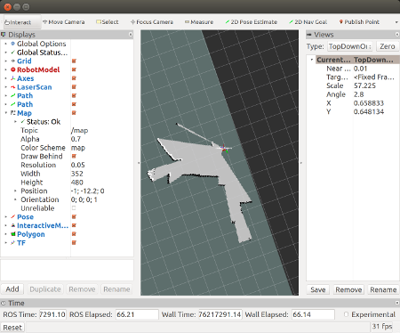
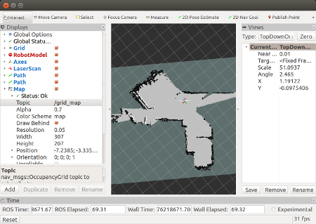
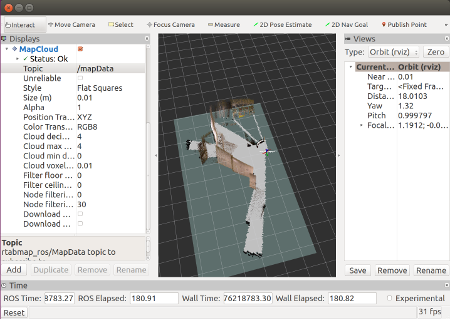
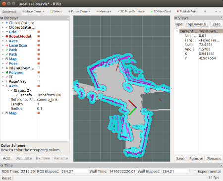

# Futurakart tutorials


## Vision part on the desktop

You can test `futurakart` and its navigation part on the PC with a connected Kinect. 
First, connect your Kinect and make sure that it is found by your system :
```
$ lsusb

Bus 001 Device 019: ID 045e:02ae Microsoft Corp. Xbox NUI Camera
Bus 001 Device 017: ID 045e:02b0 Microsoft Corp. Xbox NUI Motor
Bus 001 Device 018: ID 045e:02ad Microsoft Corp. Xbox NUI Audio

```
You can also check image reception using `freenect-glview`. 

#### Common setup 
Next, start *vision* part of `futurakart`, assuming catkin workspace is at `~/futurakart_ws`. Open a terminal and run the following: 
```
$ cd ~/futurakart_ws; source devel/setup.bash
$ roslaunch futurakart_base vision.launch 
```
Thus, you should see that kinect starts the acquisition and rtabmap's rgbd_odometry node produces the odometry. You can check this easily with
`rostopic list` in another terminal.

You can also launch rviz and visualize laser scan and visual odometry. 

#### Navigation without map
Assuming that `vision.launch` file is still running. Open another terminal and run the following:
```
$ cd ~/futurakart_ws; source devel/setup.bash;
$ roslaunch futurakart_2dnav odom_navigation.launch
```
and in another terminal execute (do not forget to `source devel/setup.bash` before) :
```
$ roslaunch futurakart_viz view_robot.launch  config:=navigation
```
Choose the topic of the `Map` to be `/move_base/local_costmap/costmap`


#### Create a map with gmapping
Assuming that `vision.launch` file is still running. Open another terminal and run the following:
```
$ cd ~/futurakart_ws; source devel/setup.bash;
$ roslaunch futurakart_2dnav create_map.launch gmapping:=true
```
and in another terminal execute (do not forget to `source devel/setup.bash` before) :
```
$ roslaunch futurakart_viz view_robot.launch  config:=navigation
```
When you move you should obtain something like this :


When you are done and want to save the map, run the following without killing the nodes:
```
$ rosrun map_server map_saver -f mymap
```

#### Create a map with rtabmap
Assuming that `vision.launch` file is still running. Open another terminal and run the following:
```
$ cd ~/futurakart_ws; source devel/setup.bash;
$ roslaunch futurakart_2dnav create_map.launch rtabmap:=true
```
and in another terminal execute (do not forget to `source devel/setup.bash` before) :
```
$ roslaunch futurakart_viz view_robot.launch  config:=navigation
```
Choose map topic `/grid_map`. When you move you should obtain something like this :


If you change the camera from an orthographic to a perspective one and add `MapCloud` with topic name `/mapData` you will get a pointclound data:


Map will be saved automatically in `~/futurakart_ws/src/futurakart/futurakart_2dnav/maps/_map.db` when you kill the nodes. 

#### Localization on the map using gmapping
Assuming that `vision.launch` file is still running. Open another terminal and run the following:
```
$ cd ~/futurakart_ws; source devel/setup.bash;
$ roslaunch futurakart_2dnav map_localization.launch gmapping:=true
```
and in another terminal execute (do not forget to `source devel/setup.bash` before) :
```
$ roslaunch futurakart_viz view_robot.launch  config:=localization
```



## Simulation
